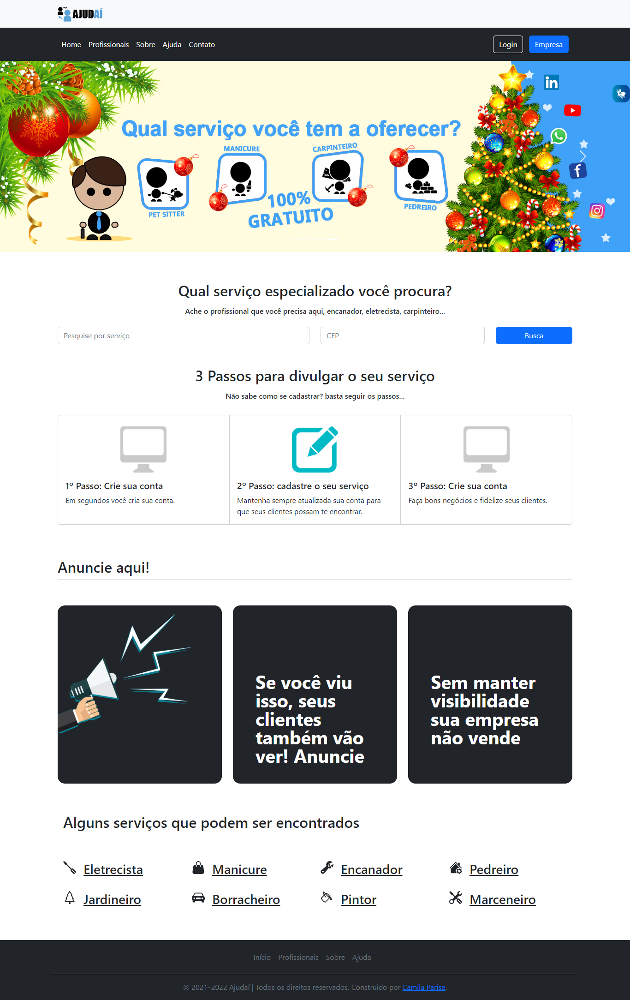

<h1 align="center"> Ajudai </h1>

Sviluppato per completare il corso di laurea .

  <a href="#-tecnologia">Tecnologia</a>&nbsp;&nbsp;&nbsp;|&nbsp;&nbsp;&nbsp;
  <a href="#-progetto">Progetto</a>&nbsp;&nbsp;&nbsp;|&nbsp;&nbsp;&nbsp;
  

  

## 🚀 Tecnologia

Questo progetto è stato sviluppato utilizzando le seguenti tecnologie:

- Photoshop
- HTML e CSS
- JavaScript
- Git e Github
- PHP
- XAMPP
- PhpMyAdmin
- Jenkins

## 💻 Progetto

Sviluppo di un'applicazione web per la registrazione dei professionisti, per aiutare questi professionisti a pubblicizzare il loro lavoro, è stata sviluppata un'applicazione web utilizzando le tecnologie più moderne del mercato, tra cui JavaScript, MySQL e PHP.

